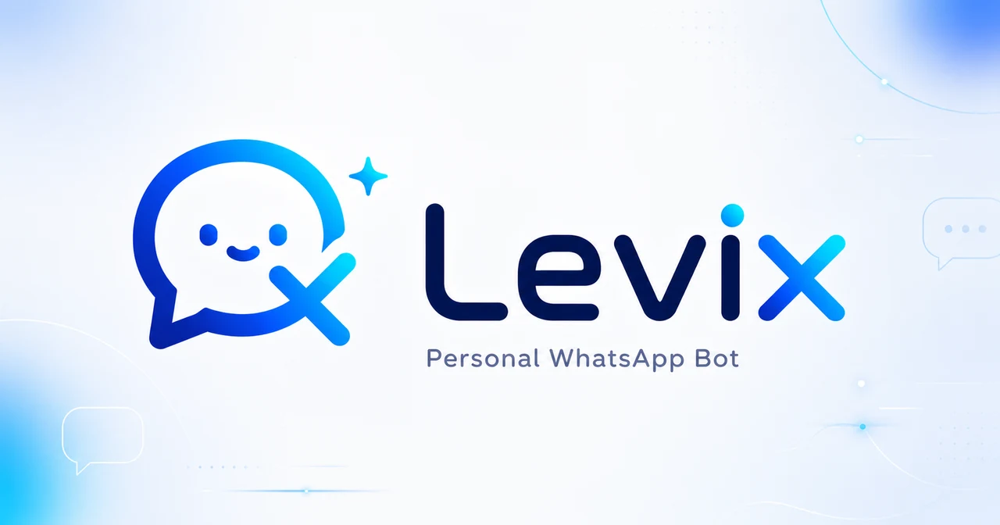

<p align="center">
  
</p>

<p align="center">
  <a href="https://github.com/Abdodiab2005/levix/actions/workflows/ci.yml"></a>
  <a href="https://www.npmjs.com/package/levix-bot"></a>
  <a href="LICENSE"></a>
  
</p>

<p align="center">
  <strong>Free, open-source, self-hosted WhatsApp automation that stays under your control.</strong>
</p>

<p align="center">
  <a href="https://levix.leviro.net">Website</a> ·
  <a href="SETUP.md">Setup guide</a> ·
  <a href="https://github.com/Abdodiab2005/levix/releases/latest">Downloads</a> ·
  <a href="https://github.com/Abdodiab2005/levix/issues">Issues</a>
</p>

Levix is a personal WhatsApp bot with 55 commands, group moderation, scheduled
messages, an AI agent, media tools, and a web control panel. You run it on your
own computer or server, keep its database and session files yourself, and can
change almost everything while it is running.

There is no paid tier, hosted account, external database, or configuration file
to maintain. Levix is released under the MIT License.

> [!WARNING]
> Levix uses [Baileys](https://github.com/WhiskeySockets/Baileys), an unofficial
> WhatsApp Web client, and is not affiliated with or endorsed by WhatsApp or
> Meta. Unofficial automation can lead to temporary restrictions or an account
> ban. Do not use Levix for spam or unsolicited bulk messaging. If an outage or
> account restriction is unacceptable, use the official WhatsApp Business
> Platform instead.

## Quick start

### Linux server

The public installer installs the latest stable release and configures Levix as
a service:

```bash
curl -fsSL https://levix.leviro.net/install.sh | bash
```

You can [read the installer](deploy/install.sh) before running it.

### npm

Requires Node.js 24 or newer:

```bash
npm install -g levix-bot
levix
```

### Docker

```bash
git clone https://github.com/Abdodiab2005/levix
cd levix
docker compose up -d
docker compose logs levix
```

Standalone Linux, macOS ARM64, and Windows binaries are available from the
[latest GitHub release](https://github.com/Abdodiab2005/levix/releases/latest).

When Levix starts:

1. Open the panel URL printed in the terminal.
2. Choose a panel password. A remote first-time setup also asks for the printed
   setup code.
3. Open **Connection**, press **Start session**, and scan the QR from WhatsApp.
4. Send `!ping` in a chat.

A successfully linked WhatsApp session resumes automatically after a process,
Docker, or systemd restart. See [SETUP.md](SETUP.md) for domains, reverse
proxies, headless mode, backups, and troubleshooting.

## What you get

| Area | What Levix provides |
| --- | --- |
| Commands | 55 commands for utilities, notes, reminders, polls, media, speech, weather, prayer times, and more |
| Group moderation | Welcome messages, anti-link, anti-spam, media rules, warnings, auto-kick, roles, rules, and notes |
| AI agent | Pick the brain from the panel — Gemini, any OpenAI-compatible server (OpenAI, OpenRouter, Ollama, ...), or Anthropic — with tools for web search, page reading, memory, and role management |
| Scheduling | One-off, daily, and weekly messages with durable jobs, delivery status, and manual retry |
| Control panel | Live connection state, command settings, roles, permissions, keys, memory, schedules, and logs |
| Media | Text, images, video, audio, QR codes, text-to-speech, and speech-to-text |
| Deployment | npm, Docker, systemd installer, standalone binaries, headless mode, and safe domain setup |
| Storage | One SQLite database and one data directory for settings, sessions, memory, and logs |

Every command can be enabled, disabled, renamed, and assigned permissions from
the panel without restarting the bot.

### AI that can act

The `!gemini` command is an agent rather than a plain chat box. It can run
several tool rounds, search the web, read a page, save long-term memories, and
manage bot roles. It narrates progress by editing one WhatsApp message and lists
sources when it uses web search.

AI is optional. The rest of Levix works without an AI key.

### Persistent schedules and memory

One-off and recurring schedules survive restarts and record their latest
delivery outcome. Long-term memory is stored as plain Markdown in
`memory/global.md` or per-chat files, so it remains readable and editable
outside the panel.

### A connection you control

The panel can start, stop, reconnect, and unlink WhatsApp while showing the
actual state: idle, waiting for a scan, connected, reconnecting, or stopped.
Reconnect attempts continue inside the bot even when no browser is open.

An optional HTTP, HTTPS, or SOCKS5 proxy can route WhatsApp traffic, including
media, without changing how the panel or AI connects.

## CLI

```text
levix                    start Levix with the web panel
levix headless           start Levix with no web UI or open port
levix where              print the data directory
levix reset-password     reset the panel password
levix domain [name]      configure a domain safely (may need sudo)
```

A fresh panel install waits for you to start the first WhatsApp pairing.
`levix headless` has no button to press, so it starts the session itself and
prints the QR in the terminal when needed.

## Data and configuration

Everything mutable lives in one data directory:

- npm installation: `~/.levix`
- source checkout: `./data`
- Docker: the `levix-data` volume

Copying this directory is a full backup, including the SQLite database, WhatsApp
session, memory, and logs.

The database is the source of truth. The prefix, permissions, API keys, server
settings, and feature options are stored in `bot_settings` and read at use
time. There is no `.env` or application configuration file to keep in sync.

Secrets are generated rather than shipped with defaults. The panel password is
stored as an scrypt hash, and the session-signing key is generated on first
start.

## Architecture

- **Node.js 24+** with ES modules and CommonJS where needed.
- **Baileys v7** for the WhatsApp connection and LID support.
- **`node:sqlite`** for a single-file datastore with no database server or
  native SQLite dependency.
- **Express + EJS** for a panel with no frontend build step or CDN dependency.
- **Pluggable AI providers** — Gemini, any OpenAI-compatible endpoint, or
  Anthropic — chosen and keyed from the control panel, no env file.
- **GitHub Actions** validation for tests, npm packaging, Docker persistence,
  and standalone executables on Linux, macOS, and Windows.

[AGENTS.md](AGENTS.md) documents the module layout, message flow, storage API,
and architectural constraints. [PACKAGING.md](PACKAGING.md) covers npm, Docker,
systemd, installers, and single-executable releases.

## Development

```bash
git clone https://github.com/Abdodiab2005/levix
cd levix
npm ci
npm test
npm start
```

Please read [CONTRIBUTING.md](CONTRIBUTING.md) before proposing a substantial
change. Bug reports and focused pull requests are welcome.

For security issues, follow [SECURITY.md](SECURITY.md) and report them
privately rather than opening a public issue.

## License

Levix is free and open source under the [MIT License](LICENSE).

Built by [Abdelrhman Diab](https://github.com/Abdodiab2005) under
[Leviro](https://leviro.net).
